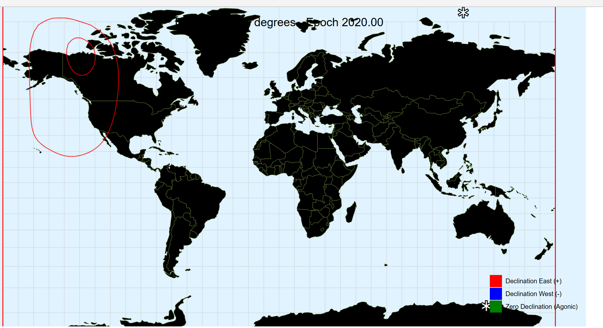

# MAGVAR

**Определение**:  
- Вариация — это угол между магнитным и географическим меридианами в любой точке, выраженный в градусах и минутах востока или запада, чтобы указать направление магнитного севера относительно истинного севера.  
- Угол между магнитным и сеточным меридианами называется сеточным магнитным углом или ГРИВИАЦИЕЙ.  
- Также называется магнитной вариацией или магнитным склонением, если требуется уточнение для предотвращения двусмысленности.

**Цель**:  
Создать таблицу с заданной частотой сетки, содержащую рассчитанные значения магнитного склонения для конкретных исходных данных.

---

## Главная задача

**Объектив**:  
Отобразить данные IGRF14 на 3D-модели Земли, построенной по стандарту WGS-84.

### Этапы реализации:
1. **3D-модель Земли с визуализацией магнитного склонения**:
   - **2.1** Парсинг коэффициентов из файла IGRF-14 для построения модели:
     - Добавить необходимые параметры для расчета векторов (дата, высота и т.д.).
     - Использовать коэффициенты из IGRF-14 для расчета D, I и вектора F с помощью сферического гармонического ряда.
     - **Примечание**: Верифицировать рассчитанные данные с использованием сертифицированных программных решений.
   - **2.2** Отображение 3D-модели Земли:
     - Простое представление в виде эллипсоида WGS-84 без ландшафта (улучшить визуализацию, если возможно).
   - **2.3** Вычисление магнитного склонения в заданной пользователем точке.
   - **2.4** Визуализация магнитного склонения:
     1. Изолинии длины вектора F на плоскости и сфере (в нТл).
     2. Изолинии угла D на плоскости и сфере.
     3. Изолинии угла I на плоскости и сфере.
     4. Визуализация вектора H на плоскости и сфере.
   - **2.5** Пользовательский интерфейс:
     - **2.5.1** Поле ввода координат пользователя с отображением данных для точки (углы D, I и длина вектора F).
     - **2.5.2** Поля отображения D, I, F.
     - **2.5.3** Поле отображения источника данных с возможностью переключения (например, IGRF-13, IGRF-14).
     - **2.5.4** Поле ввода даты (в десятичном и традиционном форматах).
     - **2.5.5** Поле ввода высоты (футы, метры, километры).
       - **Примечание**: Если дата/высота не указаны, использовать значения по умолчанию (определить их).
     - **2.5.6** Динамическое отображение шкалы масштаба.
     - **2.5.7** Выбор режима отображения оверлея магнитного склонения (векторный или изолинии).
     - **2.5.8** Опции режима изолиний для отображения компонентов D, I, F.
     - **2.5.9** *(Опционально)* Временная шкала для управления текущей датой и динамической визуализации изменений магнитного поля.
   - **2.6** Оптимизация:
     - Вычисление и отображение магнитного склонения между двумя точками.

---

## Текущие задания (на 11.06)

1. Изучить устройство модели IGRF и написать краткий отчет.
2. Проанализировать требования по MAGVAR (`t_MAGVAR_CODE`).
3. Проанализировать статью [DOI: doi.org/10.1186/s40623-020-01288-x] (о IGRF13) и написать краткий отчет.
4. Проанализировать доступные/требуемые методы визуализации магнитного склонения (2D, 3D и т.д.) и написать краткий отчет.
5. Исследовать альтернативы модели IGRF.

---

## Текущие задания (на 17.06)

1. Парсинг коэффициентов из файла IGRF-14 для построения модели.
2. Добавление необходимых параметров для расчета векторов (дата, высота и т.д.).
3. Использование коэффициентов из IGRF-14 для расчета D, I и вектора F с помощью сферического гармонического ряда.
4. Расчет значений D, I, F и их валидация через внешние решения.
---
## Текущие задания (на 23.06)

1. Сводная таблица сравнения полученных данных
2. Рендеринг двухмерной карты и оверлея изолиний (см. п. 2.4.1-2.4.3)
    **Примечание**: Использовать документ по IGRF14 в качестве референса реализации изолиний
---
## Текущие задания (на 25.06)
### Примечание: продолжить задание описанное на 23 июня
1. Добавить корректное вычисление и отображение магнитных полюсов (сейчас они отображаются некорректно)
2. Добавить численные значения для изолиний (изогоний)
3. Добавить возможность изменения шага для построения изолиний
4. Добавить подписи для широты/долготы
5. Исправить отображение Declination на карте 
6. Улучшение User-Experience
---
## Текущие задания (на 11.07)
1. Добавить возможность приближать и отдалять карту с динамической шкалой масштаба и рендерингом изолиний на меньшем масштабе
2. Dip Poles исправить отображение
2. Подписи значения для изолиний для значимых изолиний (например, каждые 5 нТл) и для значений углов (например, каждые 5°)
3. Grid Step resolution - добавить возможность уменьшения шага до десятых долей градуса (оптимизировать скорость рендеринга)
4. Расчет зон неопределенности (Uncertainty Zones) и их визуализация
5. Расчет в точке по нажатию мыши на карту